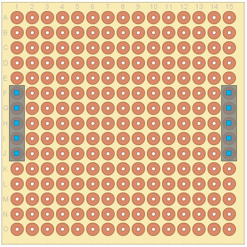
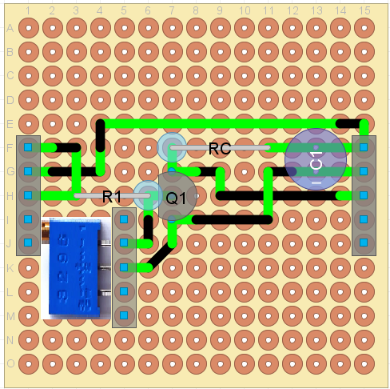
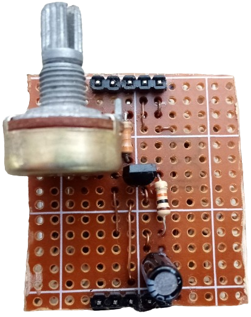
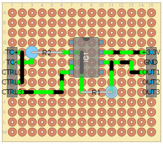
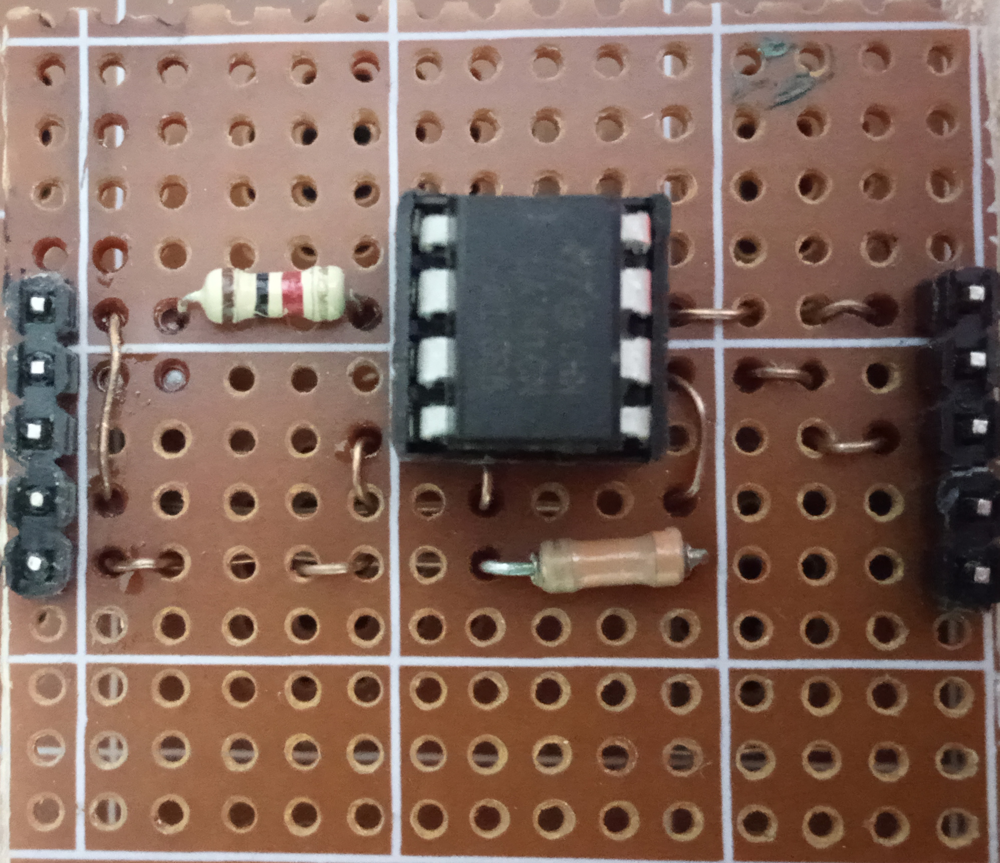

# Prototyping:

## Introduction:

At prototyping phase, multiple amplifiers are to be tested and compared
with each other. For each of these tests, a small PCB with pre-defined
inputs and outputs is to be printed. On the main PCB, there is a
pre-defined socket / header for this small amplifier test PCB. This
accelerates prototyping phase and saves money.

1.  Amplifier's pre-defined block diagram:

GND

+3.3V

Output (3-pins)

Thermocouple

Ctrl (3-pins)

Amp. Circuit

2.  Amplifier's pre-defined input / output header position:

+3.3V

OUT3

OUT2

OUT1

GND

CTRL3

CTRL2

CTRL1

TC-

TC+

{width="1.9180555555555556in"
height="1.9220833333333334in"}

# Tested amplifiers:

##  Single BJT transistor amplifier:

Using BC337 BJT NPN transistor, the following circuit is implemented. It
gives a gain of 5 \[V/V\], enabling an ADC resolution of
$\frac{1}{4096}*\frac{3.3}{5} \approx 161\mu V/LSB$

{width="1.5608661417322836in"
height="1.5883311461067366in"}{width="1.5909722222222222in"
height="1.5833333333333333in"}{width="1.2604166666666667in"
height="1.5833333333333333in"}

### Design notes:

-   As BJT amplifies $I_{B}$ at $I_{C}$, and since
    $I_{C} = \frac{3.3 - v_{o}}{R_{C}}$, value of $R_{C}$ must be low
    enough such that the amplified current is achievable across it. This
    could also be achieved by checking that
    $v_{CE,\ Fully\ On} \cong 0.2V$. Otherwise, if
    $v_{CE,\ Fully\ On} \cong few\ mV$, the operation will not be as
    expected.

### Disadvantages:

-   Has a low gain. To obtain higher gain transistors should be
    cascaded, which takes more cost when compared to the following
    circuit.

-   Automatic offset calibration is not stable.

## Op-Amp based amplifier:

-   Using UA741CN Op-Amp, the following circuit is implemented. It gives
    a gain of 33 \[V/V\], enabling an ADC resolution of
    $\frac{1}{4096}*\frac{3.3}{33} \approx 24.4\mu V/LSB$. It also
    provides stable automatic offset calibration.

{width="3.7870100612423445in"
height="2.578138670166229in"}{width="2.5896084864391953in"
height="2.2895505249343833in"}{width="2.607741688538933in"
height="2.25in"}

### Design notes:

-   As this is -- obviously -- an inverting amplifier, thermocouple is
    connected in reverse to obtain positive output.

-   **CTRL2** signal is used to select whether thermocouple is connected
    to the circuit or not. This is achieved by switching **CTRL2**
    between 0-volts level, and open-circuit level respectively.

-   **CTRL1** signal is used to select whether circuits input voltage is
    a fixed 0-volts, or thermocouple voltage. This is achieved by
    switching **CTRL1** between 0-volts level, and open-circuit level
    respectively.

-   **CTRL3** is fixed at 0-volts level all time, and used as a **GND**
    for the op-amp circuit. This is done so that when **CTRL1** or
    **CTRL2** signals are low, they appear as real zeros to the op-amp.
    As low level voltage of the I/O module in the MCU is always a little
    value above zero (real circuit **GND**).

-   To calibrate offset, thermocouple is disconnected (**CTRL2** is
    open-circuit), and amplifier's input is set to zero (**CTRL1** is
    zero). Hence, output value is equal to that of the offset).

-   To obtain thermocouple's voltage, thermocouple is -- of course -
    connected (**CTRL2** is low), and amplifier's input is dedicated to
    TC only (**CTRL1** is open-circuit). Hence, output value is equal
    to:

> $$\mathbf{A}_{\mathbf{V}}\mathbf{*\ }\mathbf{v}_{\mathbf{TC}}\mathbf{+}\mathbf{v}_{\mathbf{offset}}$$
>
> By subtracting offset value (previously obtained at a periodic
> calibration) from output's value, thermocouple's voltage can be
> obtained as follows:
>
> $$\mathbf{v}_{\mathbf{TC}}\mathbf{= \ }\frac{\mathbf{v}_{\mathbf{out}}\mathbf{- \ }\mathbf{v}_{\mathbf{offset}}}{\mathbf{A}_{\mathbf{V}}}$$

# Temperate calculation:

As thermocouple temperature calculation depends on its voltage, and
temperature of the -- virtual -- cold junction. Temperature of cold
junction is assumed to be room temperature, which could be measured
using STM32's on-chip temperature sensor.

Temperature can be calculated as follows:

$$\mathbf{v(T)}_{\mathbf{|}\mathbf{T}_{\mathbf{ref}}}\mathbf{=}\mathbf{v(T)}_{\mathbf{|0}}\mathbf{-}{\mathbf{v(}\mathbf{T}_{\mathbf{ref}}\mathbf{)}}_{\mathbf{|0}}$$

### In the above equation:

-   The term $\mathbf{v(T)}_{\mathbf{|}\mathbf{T}_{\mathbf{ref}}}$ is
    thermocouple's voltage $\mathbf{v}_{\mathbf{TC}}$ (Previous section
    discussed how to obtain it).

-   The term
    ${\mathbf{v(}\mathbf{T}_{\mathbf{ref}}\mathbf{)}}_{\mathbf{|0}}$
    could be obtained by interpolating output of the on-chip temperature
    sensor, in thermocouple's reference table.

-   Hence, the term $\mathbf{v(T)}_{\mathbf{|0}}$ can be obtained from
    the equation as follows:

> $$\mathbf{v(T)}_{\mathbf{|0}}\mathbf{=}\mathbf{v(T)}_{\mathbf{|}\mathbf{T}_{\mathbf{ref}}}\mathbf{+}{\mathbf{v(}\mathbf{T}_{\mathbf{ref}}\mathbf{)}}_{\mathbf{|0}}$$

-   Voltage $\mathbf{v(T)}_{\mathbf{|0}}$ is then interpolated in
    thermocouple's reference table to obtain value of $\mathbf{T}$.

# Noise elimination:

## Temperature noise:

From the previous calculation, the obtained temperature is coupled with
noise (Due to amplifier circuitry). These are eliminated using a SW
defined LPF.

## On / Off control hysteresis:

To avoid multiple fast relay switching which may affect both relay
circuit and the load device, a hysteresis filter is defined.

Also, relay protection SW is implemented. All it does is inserting
minimum delay between switches requested by the controlling SW.

# I/O:

-   Set-point temperature is controlled using the on-board rotary
    encoder.

-   Set-point temperature and real temperature are shown on a
    multiplexed 3-digit 7-segment display.

# Porting and configuration:

-   This SW is built to be portable for variety of MCU's, just replace
    FreeRTOS and COTS-OS/MCAL port files with these of the used target
    MCU.

-   SW is modular and can be easily modified when using different HW
    setup, or when implementing additional features.

# Prototype:
